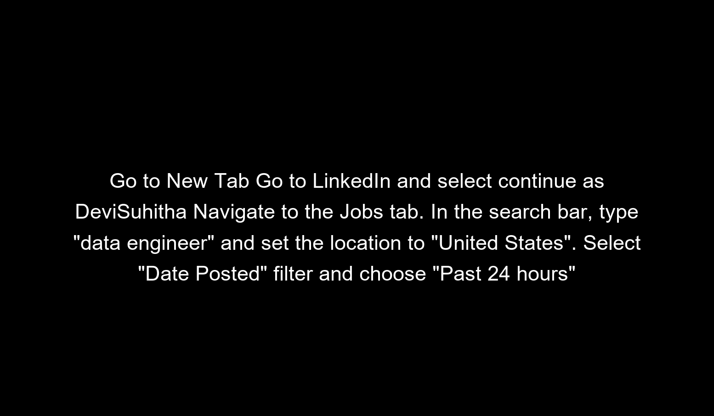

  

<h1 align="center"> <b> 🤖 AI Browser Automation with WebUI </b> </h1>

## Project Overview

This project demonstrates how to build an AI-powered browser agent that automates repetitive web tasks using **Playwright** and **Gemini (Google AI Studio)** - all through a clean and powerful UI powered by **WebUI**.

It performs actions like:
- Filling forms
- Navigating websites
- Searching online
- Automating job applications, document writing, and more

The agent uses natural language prompts and mimics human interactions in real-time using browser automation.

## 🎯 Project Goals

- Build a self-operating browser agent using AI + automation
- Perform tasks in real-time using browser agents and prompts
- Eliminate repetitive workflows with intelligent automation
- Use personal browsers (like Chrome or Edge) for logged-in actions

### WebUI:
WebUI is built on Gradio and supports most of `browser-use` functionalities. This UI is designed to be user-friendly and enables easy interaction with the browser agent.

### Expanded LLM Support:
We've integrated support for various Large Language Models (LLMs), including: Google, OpenAI, Azure OpenAI, Anthropic, DeepSeek, Ollama etc. And we plan to add support for even more models in the future.

### Custom Browser Support:
We can use your own browser with our tool, eliminating the need to re-login to sites or deal with other authentication challenges. This feature also supports high-definition screen recording.

### Persistent Browser Sessions:
We can choose to keep the browser window open between AI tasks, allowing us to see the complete history and state of AI interactions.

### Tools and Technologies Used

- **Python**                                       Core programming language for automation
- **Pip**                                          Package manager for Python dependencies
- **Git**                                           Version control system for project tracking
- **WebUI (Browser-UI)**	                           Automation framework for controlling browser
- **Google Chrome**	                                 Target browser for automation
- **Google AI Studio API**	                         For powering smart AI interactions
- **Terminal / CMD**	                               Running scripts and installations

### ⚙️ Installation Guide

Follow these steps to run the AI Browser Agent on your local machine:

### 1️⃣ Clone the WebUI repository

git clone git clone https://github.com/browser-use/web-ui.git

### Entered the cloned project directory

cd web-ui

### Verified  location inside the project

pwd

### 2️⃣ Set Up Your Environment
For Windows: To create the virtual environment:

uv venv --python 3.11

### Activate virtual environment

On Windows:
.venv\Scripts\activate

On macOS/Linux:
source .venv/bin/activate

### Install Required Packages

uv pip install -r requirements.txt

### 3️⃣ Install Playwright Browsers

playwright install

### Check That Playwright Was Installed

playwright --version

### 4️⃣ Set Up Your Environment File

cp .env.example .env

### Open .env in your editor and add your API key and settings
notepad .env    # (or use any text editor)

### 5️⃣ 🔑 Get Your Google AI Studio API Key
When you first run the agent, you might see this error:

💥 OpenAI API key not found!
Instead, we use Google Gemini (a free option with 1,500+ daily requests):

- Visit Google AI Studio
- Sign in with your Google account
- Click Create API Key
- Copy the key
- Paste it into .env like this:

GOOGLE_API_KEY=your_api_key_here
LLM_PROVIDER=google
LLM_MODEL_NAME=gemini-2.0-pro

### 6️⃣ Run the Agent in WebUI

python webui.py --ip 127.0.0.1 --port 7788

### 7️⃣ Access the Interface
Open http://127.0.0.1:7788 in your browser.
And just like that, the WebUI interface is loaded!

### To try out the dark theme, I also visited:
http://127.0.0.1:7788/?__theme=dark

### Try this sample task:

Go to google.com and search 'OpenAI'. Click the first link and return the URL.

### 📘 Project Documentation
This project isn't just code - it's a complete step-by-step guide that walks you through:

- Installing Python, Git, Pip, and virtual environment setup
- Installing and launching WebUI
- Connecting Gemini via Google AI Studio
- Using prompts for job search, document writing, and more
- Debugging common errors (API key, browser permission, etc.)

[Click here to view full documentation(PDF)](https://github.com/DeviSuhithaChundru/AI-browser-automation-with-webui/blob/main/Documentation.pdf)

Whether you're a beginner or expert, this guide makes setup foolproof and easy to extend!

### ✨ What Sets This Project Apart
✅ Full browser automation using AI
✅ Integrates with Gemini via free Google AI Studio
✅ Supports our own browser profile (Chrome, Edge)
✅ Easy configuration via .env
✅ Live UI with task history, logs, and recordings
✅ Use-case ready prompts: job search, Gmail, LinkedIn, Google Docs

### 🙌 Credits & Inspirations
This project builds on the great work from browser-use, making AI browser agents accessible through visual interfaces.

Huge thanks to the open-source community for enabling next-gen automation.

### 🎥 Result(Output)

